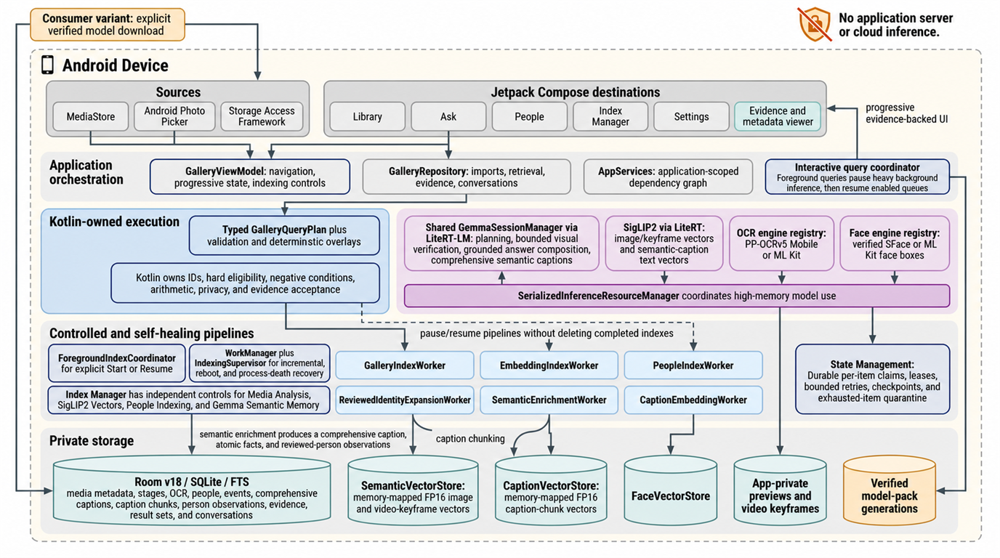
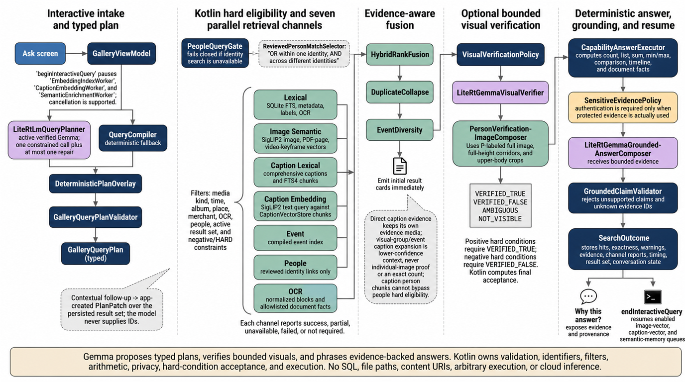
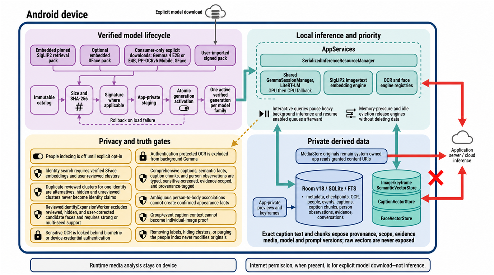

# Agentic Gallery

Agentic Gallery is a native Android application for private, fully on-device
photo, video, screenshot, PDF, OCR, people, place, event, and metadata search.
It combines deterministic Kotlin execution with local SigLIP2 retrieval and
optional Gemma inference. There is no application server and no cloud inference
path.

The simplest mental model is:

1. Android grants the app access to selected media.
2. independently controlled, self-healing workers build private metadata, OCR,
   event, people, image-vector, caption, and caption-vector indexes;
3. a typed query plan fans out across seven local retrieval channels;
4. Kotlin applies hard constraints, arithmetic, safety, and evidence checks;
5. optional local Gemma planning, verification, and answer composition improve
   the experience without owning data access or execution.

## Overall architecture



*Everything inside the dashed boundary runs on the Android device. The consumer
variant can perform an explicit, user-started model download, but the downloaded
model is verified, activated in app-private storage, and used only for local
inference.*

The UI is built with Jetpack Compose and exposes Library, Ask, People, Index
Manager, Settings, and evidence views. `GalleryViewModel` owns screen and
progress state. `GalleryRepository` orchestrates the database, retrieval
channels, and optional model-backed services supplied by the application-level
`AppServices` dependency graph.

Room v18/SQLite/FTS stores structured gallery memory, captions, caption chunks,
people observations, and durable per-item claims. Image/keyframe, caption, and
face vectors live in separate app-private stores. Explicit Start/Resume runs
through `ForegroundIndexCoordinator`; WorkManager and `IndexingSupervisor`
provide incremental fallback and recovery. `SerializedInferenceResourceManager`
and the shared `GemmaSessionManager` prevent high-memory model workloads from
competing, while interactive queries temporarily pause heavy embedding and
semantic-memory queues.

## How media becomes searchable


*Indexing uses short checkpointed batches, durable claims and leases, bounded
retries, and independent controls. Model-dependent and privacy-sensitive
branches are explicitly optional.*

The indexing path is divided into coordinated stages:

1. **Discovery and import.** `MediaImporter` and `MediaReconciler` ingest granted
   MediaStore rows, Photo Picker selections, and Storage Access Framework
   documents. Discovery records and stage state are written before expensive
   analysis starts.
2. **Base enrichment.** `GalleryIndexWorker` processes short, mixed-success
   batches: one failed item does not discard successful siblings. Images use
   EXIF-correct bounded thumbnail decoding, videos produce timestamped private
   keyframes, and PDFs produce private page previews. Local feature extraction,
   ML Kit labels, gated OCR, normalized OCR regions, and structured document
   facts are persisted in `GalleryDatabase`; `EventCompiler` rebuilds episodic
   events.
3. **Image and caption retrieval.** `EmbeddingIndexWorker` uses the verified
   SigLIP2 pack through LiteRT to embed images, PDF pages, and video keyframes
   into the memory-mapped FP16 `SemanticVectorStore`. Separately,
   `CaptionEmbeddingWorker` encodes evidence-scoped caption chunks into the
   memory-mapped FP16 `CaptionVectorStore`; the same chunks remain available
   through FTS4 lexical search.
4. **People indexing.** `PeopleIndexWorker` is disabled until explicit consent.
   A verified SFace pack enables local identity embeddings and conservative
   clustering. Users review names, aliases, merges, splits, exclusions, and
   representatives. `ReviewedIdentityExpansionWorker` can link only unreviewed,
   visible, non-user-corrected candidate faces and requires strong or
   multi-seed evidence; original media is never rewritten.
5. **Grounded semantic memory.** `SemanticEnrichmentCoordinator` creates
   bounded jobs for event, burst, duplicate, document, frequently retrieved,
   outlier, and person-family contexts. One shared local Gemma vision call
   produces a comprehensive caption, atomic semantic facts, and reviewed-person
   observations. `SemanticCaptionChunker` persists evidence-scoped chunks with
   media, scope, model, and prompt provenance, then schedules caption
   embeddings. Authentication-protected OCR is excluded.
6. **Recovery and controls.** Index Manager controls Media Analysis, SigLIP2
   Vectors, People Indexing, and Gemma Semantic Memory independently. Each
   claimed item records its owner, lease, next attempt, and last progress;
   stalled work is reclaimed, three bounded failures enter
   `FAILED_EXHAUSTED`, and completed indexes are never deleted merely to resume
   a queue.

Battery, storage, thermal, charging, and idle admission rules keep background
work bounded. `beginInteractiveQuery` makes active embedding and semantic
workers yield; `endInteractiveQuery` re-enqueues enabled unfinished queues.

## How a question becomes an answer



*Initial result cards can appear before optional visual verification and answer
composition finish. Every channel reports whether it succeeded, was partial,
was unavailable, failed, or was not required.*

The Ask flow is deliberately split between model suggestions and app-owned
execution:

1. Two alternative planners feed the same deterministic overlay:
   `LiteRtLmQueryPlanner` uses an active verified Gemma pack for one constrained
   call and at most one repair, while `QueryCompiler` is the no-model fallback.
2. `DeterministicPlanOverlay` and `GalleryQueryPlanValidator` accept only the
   bounded typed `GalleryQueryPlan` contract. Contextual follow-ups use an
   app-created `PlanPatch` over a persisted result set; the model never provides
   result-set IDs or media IDs.
3. Kotlin applies media, time, album, place, merchant, OCR, people, follow-up,
   negative, and hard eligibility rules before retrieval. For people queries,
   `ReviewedPersonMatchSelector` treats duplicate reviewed clusters for one
   identity as OR alternatives while keeping different identities as AND
   requirements; `PeopleQueryGate` fails closed when identity search is
   unavailable.
4. Seven local channels execute in parallel: lexical FTS, SigLIP2 image
   semantic, caption lexical, caption embedding, compiled event, reviewed
   people, and structured OCR. Each reports success, partial, unavailable,
   failed, or not required.
5. `HybridRankFusion`, duplicate collapse, and event diversity produce the
   initial ranking. Direct caption evidence retains its evidence media. Visual
   group and event expansion is lower-confidence context, never proof about an
   individual image or an exact count; person-caption chunks cannot bypass
   people hard eligibility.
6. Fine-grained, relational, comparative, or negative requests can invoke
   bounded `LiteRtGemmaVisualVerifier` evaluation over candidate images or
   matched private video keyframes. Person verification uses EXIF-correct
   P-labelled full images, full-height corridors, and upper-body crops. The
   typed verdict is `VERIFIED_TRUE`, `VERIFIED_FALSE`, `AMBIGUOUS`, or
   `NOT_VISIBLE`; Kotlin still computes final hard-condition acceptance.
7. Counts, lists, sums, min/max, comparisons, timelines, and document facts are
   computed deterministically. Optional `LiteRtGemmaGroundedAnswerComposer`
   receives bounded evidence, and `GroundedClaimValidator` rejects unsupported
   claims or unknown evidence IDs.
8. The final `SearchOutcome` records hits, exactness, warnings, evidence,
   channel coverage, timing, and conversation state. The UI exposes the same
   provenance through **Why this answer?**, then resumes enabled background
   queues.

Model output cannot express SQL, filesystem paths, content URIs, authorization
rules, or arbitrary execution.

## Privacy and verified model lifecycle



*Internet permission, when present in the consumer variant, supports explicit
model download—not inference. Runtime media analysis remains on device.*

- Embedded or downloaded model packs are checked against immutable catalog
  metadata, expected size, SHA-256, and signatures where applicable.
- Packs are staged privately, activated as atomic generations, and rolled back
  after load failure. Local engines read only active verified generations.
- People indexing is off by default. Identity queries require a verified face
  embedding engine and a user-reviewed cluster; hidden and unreviewed clusters
  never resolve as identities.
- Reviewed identity expansion excludes reviewed, hidden, and user-corrected
  candidates and requires strong or multi-seed support. Ambiguous
  person-to-body associations cannot become confirmed appearance facts.
- Sensitive OCR evidence is classified and requires biometric or
  device-credential authentication. Protected OCR is not sent to background
  semantic enrichment.
- Comprehensive captions, caption chunks, semantic facts, and person
  observations are typed, sensitive-screened, evidence-scoped, and
  provenance-tagged. Group or event context never becomes per-image proof.
- Exact caption evidence exposes its source media, model, and prompt versions;
  raw image, caption, and face vectors are never exposed to answer composition.
- Removing a label, hiding a cluster, or purging the people index does not
  modify MediaStore originals.
- Memory-pressure and idle eviction release the shared Gemma engine without
  deleting indexed data or model generations.

## Component map

| Area | Primary source | Responsibility |
|---|---|---|
| Compose shell and destinations | [`MainActivity.kt`](android/app/src/main/java/com/samsung/agenticgallery/MainActivity.kt) | Library, Ask, People, Settings, indexing, result, viewer, and evidence UI |
| UI state and operations | [`GalleryViewModel.kt`](android/app/src/main/java/com/samsung/agenticgallery/GalleryViewModel.kt) | Navigation, imports, indexing controls, people review, model state, and progressive query state |
| Dependency graph | [`AgenticGalleryApplication.kt`](android/app/src/main/java/com/samsung/agenticgallery/AgenticGalleryApplication.kt) | Application-scoped database, model managers, engines, vector stores, and shared sessions |
| Search orchestration | [`GalleryRepository.kt`](android/app/src/main/java/com/samsung/agenticgallery/GalleryRepository.kt) | Scope resolution, parallel retrieval, fusion, verification, answers, evidence, and result-set persistence |
| Contracts and plans | [`GalleryModels.kt`](android/app/src/main/java/com/samsung/agenticgallery/GalleryModels.kt) | Typed query, filter, evidence, channel-report, result, and indexing contracts |
| Structured storage | [`GalleryDatabase.kt`](android/app/src/main/java/com/samsung/agenticgallery/GalleryDatabase.kt) and [`GalleryRoomDatabase.kt`](android/app/src/main/java/com/samsung/agenticgallery/GalleryRoomDatabase.kt) | Room v18/SQLite/FTS data, migrations, durable claims, captions, chunks, people observations, events, OCR, facts, and conversations |
| Base indexing | [`GalleryIndexWorker.kt`](android/app/src/main/java/com/samsung/agenticgallery/GalleryIndexWorker.kt) | Resumable media analysis batches and event rebuild scheduling |
| Semantic vectors | [`EmbeddingIndexWorker.kt`](android/app/src/main/java/com/samsung/agenticgallery/EmbeddingIndexWorker.kt) | SigLIP2 media/keyframe embedding and vector-store reconciliation |
| Caption retrieval | [`SemanticCaptionModels.kt`](android/app/src/main/java/com/samsung/agenticgallery/SemanticCaptionModels.kt), [`CaptionEmbeddingWorker.kt`](android/app/src/main/java/com/samsung/agenticgallery/CaptionEmbeddingWorker.kt), and [`CaptionVectorStore.kt`](android/app/src/main/java/com/samsung/agenticgallery/CaptionVectorStore.kt) | Evidence-scoped caption chunks, FTS4 text, SigLIP2 text embeddings, and memory-mapped FP16 caption-vector search |
| People index | [`PeopleIndexWorker.kt`](android/app/src/main/java/com/samsung/agenticgallery/PeopleIndexWorker.kt) | Opt-in face detection, embeddings, conservative clustering, and checkpoints |
| Reviewed identities | [`ReviewedPersonMatchSelector.kt`](android/app/src/main/java/com/samsung/agenticgallery/ReviewedPersonMatchSelector.kt) and [`ReviewedIdentityExpansionWorker.kt`](android/app/src/main/java/com/samsung/agenticgallery/ReviewedIdentityExpansionWorker.kt) | Same-identity OR matching, different-identity AND matching, and conservative unreviewed-face expansion |
| Semantic memory | [`SemanticEnrichmentWorker.kt`](android/app/src/main/java/com/samsung/agenticgallery/SemanticEnrichmentWorker.kt) | Comprehensive grounded captions, atomic facts, reviewed-person observations, provenance, and protected-OCR exclusion |
| Index controls and recovery | [`ForegroundIndexCoordinator.kt`](android/app/src/main/java/com/samsung/agenticgallery/ForegroundIndexCoordinator.kt), [`IndexingJobControls.kt`](android/app/src/main/java/com/samsung/agenticgallery/IndexingJobControls.kt), [`IndexingReliabilityPolicy.kt`](android/app/src/main/java/com/samsung/agenticgallery/IndexingReliabilityPolicy.kt), and [`IndexingRuntimeStatus.kt`](android/app/src/main/java/com/samsung/agenticgallery/IndexingRuntimeStatus.kt) | Independent Start/Resume controls, foreground execution, durable claims and leases, bounded retries, recovery, and runtime progress |
| Shared Gemma runtime | [`GemmaSessionManager.kt`](android/app/src/main/java/com/samsung/agenticgallery/GemmaSessionManager.kt) | Serialized LiteRT-LM GPU/CPU initialization, reuse, cancellation, and eviction |
| Model boundaries | [`ModelPackManager.kt`](android/app/src/main/java/com/samsung/agenticgallery/ModelPackManager.kt), [`RetrievalModelPack.kt`](android/app/src/main/java/com/samsung/agenticgallery/RetrievalModelPack.kt), [`OcrModelPack.kt`](android/app/src/main/java/com/samsung/agenticgallery/OcrModelPack.kt), and [`FaceModelPack.kt`](android/app/src/main/java/com/samsung/agenticgallery/FaceModelPack.kt) | Verified download/import, app-private generations, activation, capability reporting, and rollback |

## Repository layout

- `android/`: Kotlin, Jetpack Compose, Room, WorkManager, JNI, unit tests, and
  connected-device tests.
- `demo-assets/`: consented demo media embedded by Android builds.
- `tools/device/`: Android seeding, profiling, model installation, and
  connected-device acceptance tooling.
- `tools/model-conversion/`: signed/checksummed local model-pack preparation.
- `tools/sample_gallery/`: synthetic and stress-gallery generation.
- `scripts/verify_demo_library.py`: demo-media verification.
- `docs/`: implementation evidence, requirements, testing, licensing,
  architecture images, and versioning.
- `s-Gallery/`: Samsung Gallery and Agentic Gallery visual references.

## Android variants

- `ciDebug`: model-independent fixture engines for source and unit-test builds.
- `offlineDemoDebug`: embedded retrieval/face assets and no Internet permission.
- `consumerDebug`: user-started model downloads with all inference remaining
  on device.

## Build and test

Configure an Android SDK, then run from `android/`:

```powershell
.\gradlew.bat :app:assembleCiDebug
.\gradlew.bat :app:testCiDebugUnitTest
```

Model-bearing builds use ignored local artifacts:

- `build/siglip2-base-p16-224-q8-core05.agretrieval`
- `build/models/face/face_recognition_sface_2021dec.onnx`

Build a device variant with:

```powershell
.\gradlew.bat :app:assembleConsumerDebug
```

See [`android/README.md`](android/README.md) for Android-specific operation,
[`docs/ANDROID_REQUIREMENTS_AUDIT.md`](docs/ANDROID_REQUIREMENTS_AUDIT.md) for
the implementation matrix, and
[`docs/implementation-status.md`](docs/implementation-status.md) for
evidence-backed test and device status.
