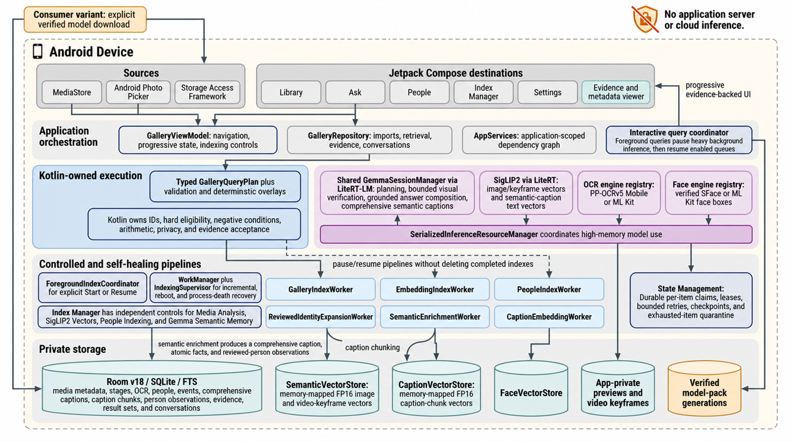
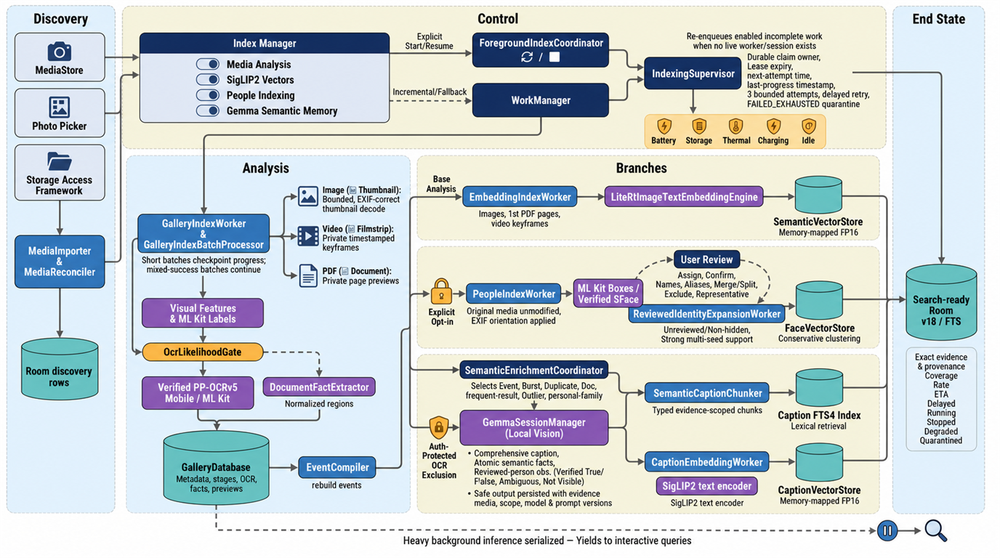
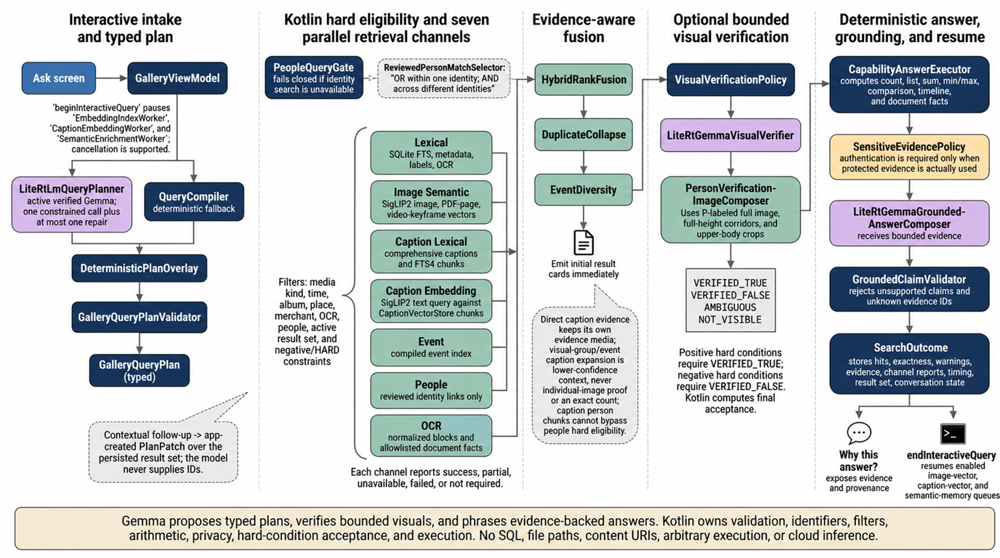

# AskAlbum: AI Photo Search

<p align="center">
  
</p>

<p align="center">
  <strong>Ask your photos anything - privately and offline.</strong>
</p>

<p align="center">
  <a href="https://github.com/anup42/AskAlbum/actions/workflows/android.yml"></a>
  <a href="https://github.com/anup42/AskAlbum/releases/latest"></a>
  <a href="LICENSE"></a>
  
  
</p>

AskAlbum is a native Android app for searching and asking grounded questions
across photos, videos, screenshots, PDFs, OCR, people, places, events, and
metadata. Retrieval and inference run on the phone. There is no application
server and no cloud inference path.

> [!IMPORTANT]
> AskAlbum is an early open-source preview. The model-independent `ciDebug`
> variant is reproducible from source. Production model packs are intentionally
> not committed, and accelerator support varies by Android device.

## Ask questions, not filenames

```text
Show beach sunset photos from 2024.
Pichle saal Goa wali family photos dikhao.
What was the total on my latest Swiggy receipt?
Show pictures where my wife is wearing white shoes.
How many photos contain a dog?
Show my Singapore trip. Only Marina Bay. Now just videos.
```

AskAlbum can return ranked media, a grounded text answer, or both, depending on
the request. Counts and answers expose channel coverage: a bounded semantic
pass is reported as an estimate, never as a complete gallery scan.

## Why AskAlbum

| | AskAlbum approach |
|---|---|
| **Private by design** | Media, OCR, faces, vectors, captions, and query execution stay on device. |
| **More than image similarity** | Fuses metadata, OCR, caption FTS, caption embeddings, SigLIP2 image vectors, reviewed people, events, and query-time verification. |
| **Grounded answers** | Kotlin owns filters, arithmetic, permissions, and execution; model output is constrained to typed plans and bounded evidence. |
| **Reviewed identities** | Face indexing is opt-in, and only user-reviewed people can resolve names, relationships, and aliases. |
| **Truthful failures** | Retrieval channels report `SUCCESS`, `PARTIAL`, `UNAVAILABLE`, `FAILED`, or `NOT_REQUIRED` instead of collapsing failures into empty results. |
| **Resumable indexing** | Durable leases, short checkpoints, bounded retries, poison-item isolation, and foreground controls preserve completed work. |

## What works today

- Natural-language retrieval over photos, videos, screenshots, PDF previews,
  OCR, metadata, people, places, and compiled events.
- Deterministic `FIND_MEDIA`, `LIST`, `COUNT`, `ANSWER_FACT`, `DOCUMENT_QA`,
  `SUM`, `MIN_MAX`, `EVENT_SUMMARY`, `TIMELINE`, and `COMPARE` execution paths.
- English, Hindi, and Hinglish query variants with canonical-query rank fusion.
- Evidence-scoped comprehensive captions, activity observations, semantic
  facts, FTS chunks, and caption embeddings.
- Reviewed People workflows for names, relationships, aliases, merges, splits,
  exclusions, representatives, hiding, and local reset.
- Authentication-gated sensitive OCR facts and verified model-pack lifecycle.
- Independent controls and truthful progress for media, image-vector, People,
  caption-vector, and Gemma semantic-memory indexing.

## Quick start

### Requirements

- Android Studio or the Android SDK command-line tools
- JDK 17
- Git

### Build the fixture variant

```bash
git clone https://github.com/anup42/AskAlbum.git
cd AskAlbum/android
./gradlew :app:testCiDebugUnitTest :app:assembleCiDebug --no-daemon
```

On Windows PowerShell, use `./gradlew.bat` instead of `./gradlew`.

The fixture build does not require private model artifacts. Its APK is written
under `android/app/build/outputs/apk/ci/debug/`.

### Android variants

| Variant | Purpose | Internet permission |
|---|---|---|
| `ciDebug` | Model-independent fixture engines for builds and unit tests | No |
| `offlineDemoDebug` | Embedded demo retrieval/face assets | No |
| `consumerDebug` | User-started verified model downloads; inference remains local | Yes, for model download only |

Model-bearing local builds use ignored artifacts documented in
[`android/README.md`](android/README.md). Model binaries are not part of the
Apache-2.0 source release and remain subject to their upstream licenses.

## How it works

The simplest mental model is:

1. Android grants AskAlbum access to selected media.
2. Independent, self-healing workers build metadata, OCR, event, people,
   image-vector, caption, and caption-vector indexes.
3. A typed query plan fans out across local retrieval channels.
4. Kotlin applies hard constraints, aggregation, privacy, and evidence rules.
5. Optional local Gemma planning, verification, and answer composition improve
   recall and readability without owning data access or execution.

### On-device architecture



Everything inside the dashed boundary runs on the Android device. The consumer
variant can perform an explicit model download, but the pack is verified,
activated in app-private storage, and used only for local inference.

### Indexing and semantic memory



- **Discovery:** MediaStore, Photo Picker, and Storage Access Framework sources
  are recorded before expensive analysis starts.
- **Base analysis:** EXIF-correct thumbnails, private video keyframes, PDF page
  previews, local labels, gated OCR, document facts, and events are persisted.
- **Vectors:** SigLIP2 image/keyframe vectors and caption-chunk text vectors use
  separate app-private stores and evidence namespaces.
- **People:** SFace-based indexing remains off until explicit consent. Reviewed
  corrections are preserved during conservative identity expansion.
- **Semantic memory:** Selected images receive one shared local Gemma vision
  call for a comprehensive caption, atomic facts, activity evidence, and
  reviewed-person observations. Protected OCR is excluded.
- **Recovery:** Claimed items record owner, lease, next attempt, and progress;
  bounded poison items cannot starve a healthy queue.

### Retrieval and grounded answers



Hard people, media, date, place, merchant, document, and result-set filters are
resolved before top-K search. Metadata/OCR lexical results, caption FTS,
caption embeddings, SigLIP2 image vectors, people, and event evidence are fused
by rank. Fine-grained requests can invoke bounded visual verification over an
image or matched video keyframe. Kotlin computes final acceptance and all
arithmetic; optional Gemma composition can only describe supplied evidence.

### Privacy and model lifecycle


- Model packs are checked against catalog metadata, size, SHA-256, and
  signatures where applicable, then activated as atomic generations.
- People indexing is off by default. Hidden and unreviewed clusters never
  resolve as named identities.
- Sensitive OCR requires biometric or device-credential authentication and is
  excluded from background semantic enrichment.
- Group and event context can discover candidates but cannot become per-image
  proof, person appearance proof, or an exact count.
- Removing a person label or resetting the People index never modifies
  MediaStore originals.

Read the full boundaries in [`PRIVACY.md`](PRIVACY.md),
[`SECURITY.md`](SECURITY.md), and
[`docs/ANDROID_REQUIREMENTS_AUDIT.md`](docs/ANDROID_REQUIREMENTS_AUDIT.md).

## Project map

| Area | Primary source |
|---|---|
| Compose UI and navigation | [`MainActivity.kt`](android/app/src/main/java/io/github/anup42/askalbum/MainActivity.kt) |
| UI state and operations | [`GalleryViewModel.kt`](android/app/src/main/java/io/github/anup42/askalbum/GalleryViewModel.kt) |
| Dependency graph | [`AskAlbumApplication.kt`](android/app/src/main/java/io/github/anup42/askalbum/AskAlbumApplication.kt) |
| Search orchestration | [`GalleryRepository.kt`](android/app/src/main/java/io/github/anup42/askalbum/GalleryRepository.kt) |
| Typed contracts | [`GalleryModels.kt`](android/app/src/main/java/io/github/anup42/askalbum/GalleryModels.kt) |
| Room/SQLite/FTS storage | [`GalleryDatabase.kt`](android/app/src/main/java/io/github/anup42/askalbum/GalleryDatabase.kt) and [`GalleryRoomDatabase.kt`](android/app/src/main/java/io/github/anup42/askalbum/GalleryRoomDatabase.kt) |
| Base indexing | [`GalleryIndexWorker.kt`](android/app/src/main/java/io/github/anup42/askalbum/GalleryIndexWorker.kt) |
| Image vectors | [`EmbeddingIndexWorker.kt`](android/app/src/main/java/io/github/anup42/askalbum/EmbeddingIndexWorker.kt) |
| Caption retrieval | [`CaptionEmbeddingWorker.kt`](android/app/src/main/java/io/github/anup42/askalbum/CaptionEmbeddingWorker.kt) and [`CaptionVectorStore.kt`](android/app/src/main/java/io/github/anup42/askalbum/CaptionVectorStore.kt) |
| People indexing | [`PeopleIndexWorker.kt`](android/app/src/main/java/io/github/anup42/askalbum/PeopleIndexWorker.kt) |
| Semantic memory | [`SemanticEnrichmentWorker.kt`](android/app/src/main/java/io/github/anup42/askalbum/SemanticEnrichmentWorker.kt) |
| Shared Gemma runtime | [`GemmaSessionManager.kt`](android/app/src/main/java/io/github/anup42/askalbum/GemmaSessionManager.kt) |

The repository keeps Android implementation under `android/`, privacy-safe demo
media under `demo-assets/`, device/model utilities under `tools/`, and evidence
and architecture documentation under `docs/`.

## Contribute

AskAlbum needs Android, on-device ML, retrieval, privacy, accessibility, test,
and technical-writing contributors.

- Start with [`good first issue`](https://github.com/anup42/AskAlbum/labels/good%20first%20issue)
  or [`help wanted`](https://github.com/anup42/AskAlbum/labels/help%20wanted).
- Propose and refine ideas in
  [Discussions](https://github.com/anup42/AskAlbum/discussions).
- Read [`CONTRIBUTING.md`](CONTRIBUTING.md) before opening a pull request.
- Report vulnerabilities privately through
  [GitHub Security Advisories](https://github.com/anup42/AskAlbum/security/advisories/new),
  never through a public issue.

Do not submit personal photos, gallery databases, model binaries, APKs,
credentials, device logs, or generated review archives.

## License and independence

AskAlbum source is licensed under [Apache-2.0](LICENSE). Optional model packs
are not bundled and keep their own upstream terms; see
[`THIRD_PARTY_NOTICES.md`](THIRD_PARTY_NOTICES.md) and
[`docs/model-licenses.md`](docs/model-licenses.md).

AskAlbum is an independent open-source project and is not affiliated with
Samsung, Google, OpenAI, or upstream model authors.

Current release: [AskAlbum 0.1.0](https://github.com/anup42/AskAlbum/releases/tag/v0.1.0)

